# 📦 API REST de Gerenciamento de Brinquedos - Spring Boot

------------------------------------------------------------------------

## 📌 Descrição Geral

Este projeto consiste no desenvolvimento de uma API RESTful para
gerenciamento de brinquedos, utilizando **Spring Boot** com persistência
em banco de dados **Oracle FIAP**.

A aplicação implementa integralmente as operações de **CRUD (Create,
Read, Update, Delete)**, permitindo manipulação completa dos dados via
requisições HTTP.

O projeto foi estruturado seguindo boas práticas de desenvolvimento
backend, com separação de responsabilidades em camadas (Controller,
Service, Repository e Model).

------------------------------------------------------------------------

## 🎯 Objetivo do Projeto

Atender aos requisitos do Checkpoint 2, contemplando:

-   Integração com banco Oracle
-   Implementação de CRUD completo
-   Testes via HTTP (Insomnia/Postman)
-   Documentação técnica com evidências visuais
-   Uso de JSON para comunicação

------------------------------------------------------------------------

## 🛠️ Tecnologias Utilizadas

-   Java 17+
-   Spring Boot
-   Spring Web (API REST)
-   Spring Data JPA (persistência)
-   Hibernate (ORM)
-   Oracle Database (FIAP)
-   Maven (gerenciamento de dependências)
-   Insomnia (testes HTTP)

------------------------------------------------------------------------

## 🧱 Arquitetura do Projeto

O sistema foi desenvolvido utilizando arquitetura em camadas:

    Controller → Recebe requisições HTTP
    Service → Contém regras de negócio
    Repository → Acesso ao banco via JPA
    Model → Representação da entidade (tabela)

📸 Estrutura do projeto:

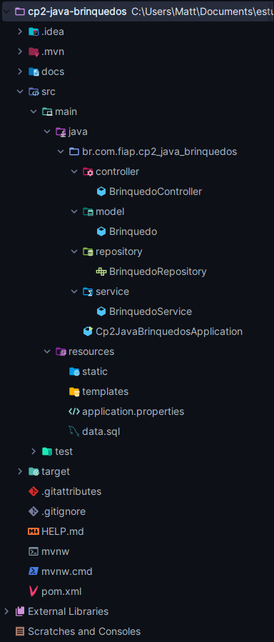

------------------------------------------------------------------------

## ⚙️ Configuração do Projeto

A aplicação foi criada via Spring Initializr com as seguintes
dependências:

📸 Spring Initializr:

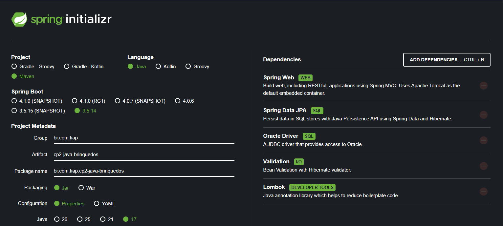

### Configuração do banco (application.properties)

A conexão com o banco Oracle FIAP é realizada via variáveis de ambiente:

📸 Configuração:

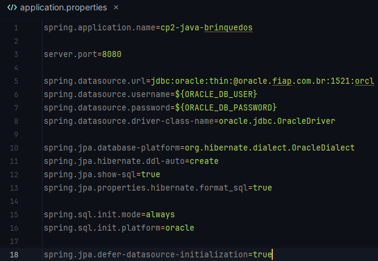

Principais configurações:

-   `spring.jpa.hibernate.ddl-auto=create` → cria tabela automaticamente
-   `spring.jpa.defer-datasource-initialization=true` → executa data.sql
    após criação
-   `spring.sql.init.mode=always` → garante execução do script SQL

------------------------------------------------------------------------

## 🗄️ Modelagem do Banco de Dados

Tabela: **TDS_TB_BRINQUEDOS**

Campos:

-   ID (Primary Key)
-   NOME
-   TIPO
-   CLASSIFICACAO
-   TAMANHO
-   PRECO

📸 Visualização no Oracle:

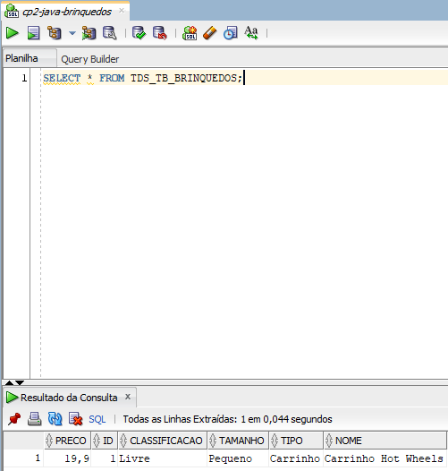

------------------------------------------------------------------------

## 🚀 Inicialização Automática

O projeto utiliza inicialização automática do banco:

-   Hibernate cria a tabela automaticamente
-   Script `data.sql` insere dados iniciais

📸 Script data.sql:

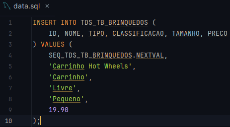

------------------------------------------------------------------------

## 🔗 Endpoints da API

  Método   Endpoint           Descrição
  -------- ------------------ ---------------------------
  GET      /brinquedos        Lista todos os brinquedos
  GET      /brinquedos/{id}   Busca brinquedo por ID
  POST     /brinquedos        Cadastra novo brinquedo
  PUT      /brinquedos/{id}   Atualiza brinquedo
  DELETE   /brinquedos/{id}   Remove brinquedo

------------------------------------------------------------------------

## 📥 Exemplo de JSON

``` json
{
  "nome": "Boneca Barbie",
  "tipo": "Boneca",
  "classificacao": "Livre",
  "tamanho": "Médio",
  "preco": 89.90
}
```

------------------------------------------------------------------------

## 🧪 Testes da API

### 🔹 GET inicial (dados do seed)

Retorna lista inicial de brinquedos inseridos automaticamente.

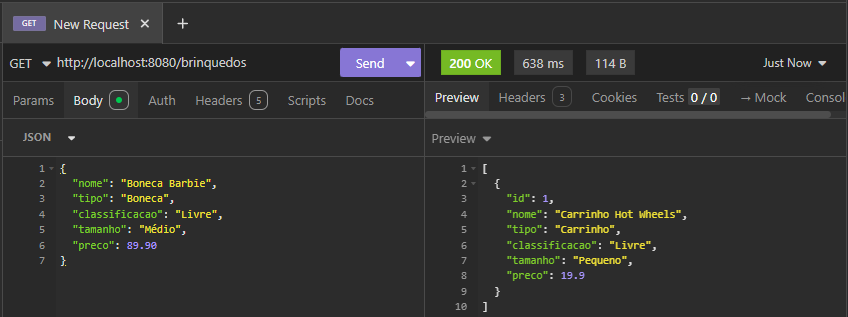

------------------------------------------------------------------------

### 🔹 POST (Cadastro)

Inserção de novo brinquedo via JSON.

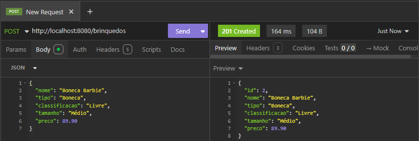

------------------------------------------------------------------------

### 🔹 GET (Listagem)

Validação da persistência no banco.

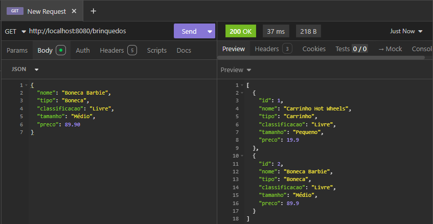

------------------------------------------------------------------------

### 🔹 GET por ID

Busca específica por identificador.

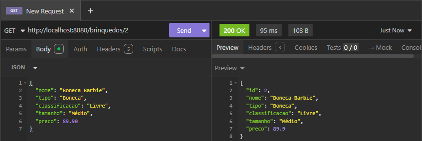

------------------------------------------------------------------------

### 🔹 PUT (Atualização)

Atualização dos dados do brinquedo.

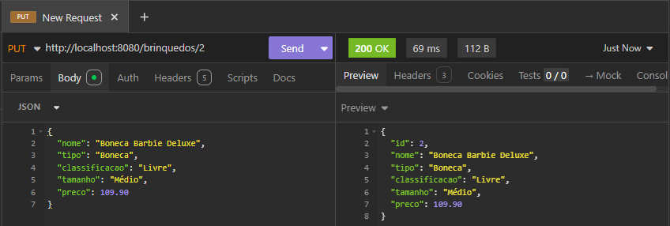

------------------------------------------------------------------------

### 🔹 DELETE

Exclusão com retorno de mensagem amigável.

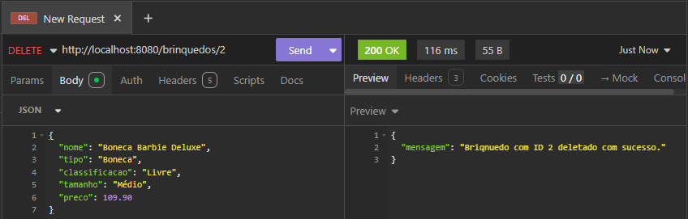

------------------------------------------------------------------------

### 🔹 GET após DELETE

Validação da exclusão (retorno 404).

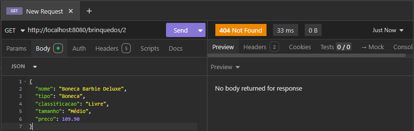

------------------------------------------------------------------------

## 🖥️ Execução da Aplicação

📸 Aplicação rodando:

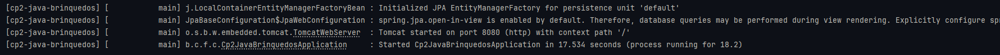

------------------------------------------------------------------------

## ▶️ Como Executar o Projeto

1.  Clonar o repositório
2.  Configurar variáveis de ambiente:

```{=html}
<!-- -->
```
    ORACLE_DB_USER=seu_usuario
    ORACLE_DB_PASSWORD=sua_senha

3.  Executar a aplicação
4.  Testar endpoints via Insomnia/Postman

------------------------------------------------------------------------

## 📄 Integrantes

Nome Sobrenome - RM XXXXX

------------------------------------------------------------------------

## 📌 Considerações Finais

Este projeto demonstra:

-   Implementação completa de API REST
-   Integração com banco Oracle
-   Uso de JPA/Hibernate para persistência
-   Estrutura organizada em camadas
-   Testes documentados com evidências reais

Atende integralmente aos requisitos do Checkpoint 2, com implementação
funcional e documentação técnica detalhada.

------------------------------------------------------------------------

## ✅ Conclusão

Projeto desenvolvido com sucesso, contemplando:

-   CRUD completo
-   Persistência Oracle
-   Testes HTTP
-   Documentação com evidências
